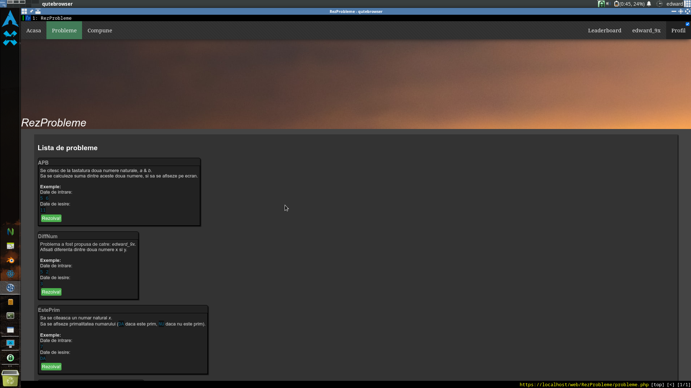
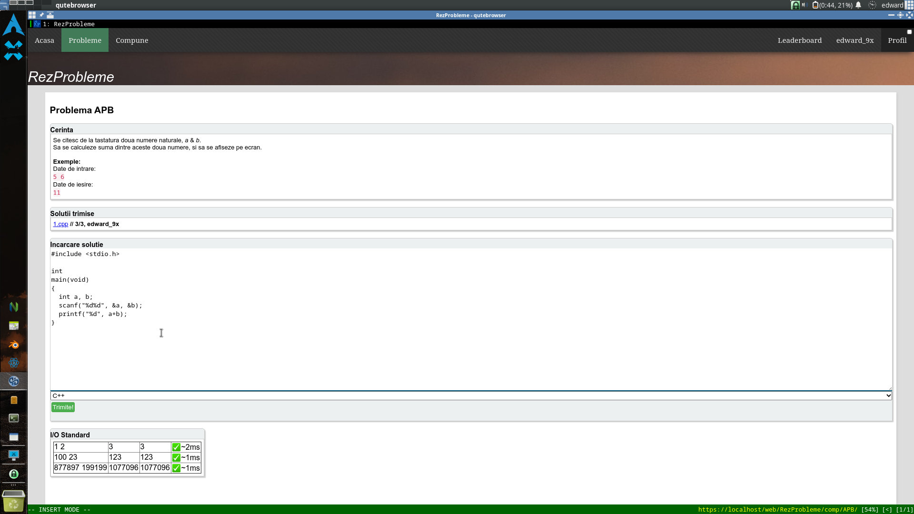
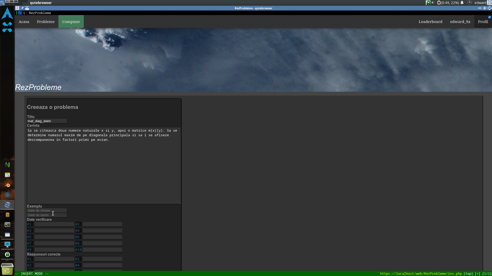
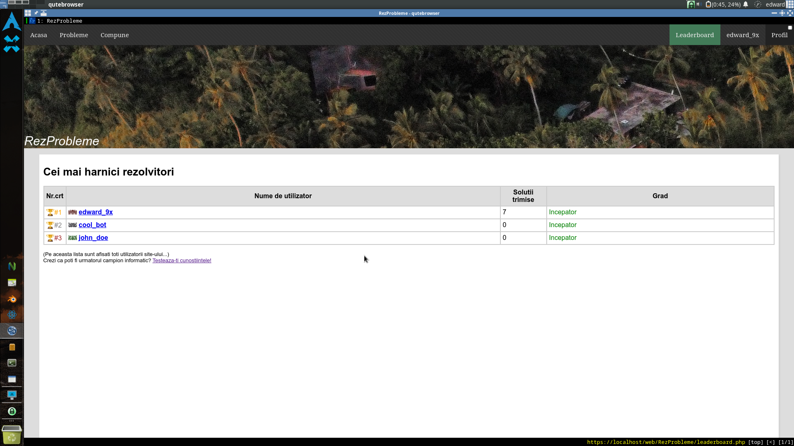
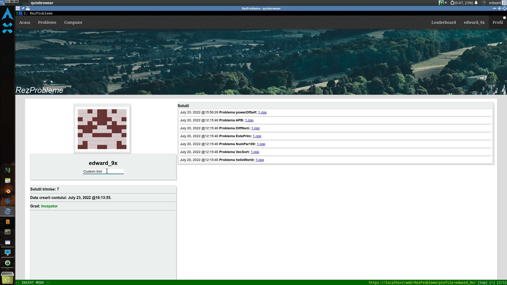

# RezProbleme
Platforma interactiva & modulara pentru probleme de informatica.

# Software necesar
 - Un server web cu suport PHP (ex. Apache);
 - Colectia de compilatoare GNU GCC;
 - Diverse compilatoare/interpreter-uri pentru solutii (ex. DMD, Python, etc.)
 - Un browser (NU mai trebuie suport Javascript neaparat!);
 - Nucleul Linux, pentru seccomp(2);
 - libseccomp/seccomp-bpf
 - POSIX sh, pentru compilare.php;

# BCCVM - Un limbaj ezoteric de programare
BCCVM este un limbaj de programare ezoteric in care programele sunt stocate pe un plan bidimensional. Limbajul a fost implementat de la zero. Este inspirat din Befunge98, ><> si Forth. Utilizatorii pot incarca solutii in acest limbaj ca si cu orice alt limbaj (ex C/C++, D).

Detalii: <https://github.com/Edd12321/bccvm>

# Capturi de ecran

# Configuratie
`gcc src/wrap.c -lseccomp -o wrap`

Mai intai, wrap.c face un whitelist cu toate syscall-urile acceptabile, apoi nu lasa anumite syscall-uri din a fi executate (ex stat, unlink)

`wrap.c` este un filtru pentru a evita executarea de cod arbitrar.

`auth.php` menajeaza conturile utilizatorilor si verifica salted hash-urile parolelor

`bl.csv` este un istoric al modificarilor majore al proiectului

`style.css` contine design-ul grafic al paginii,

`index.php` contine pagina in sine (bara, etc.),

`config.php` contine variabile aleatorii,

`inv.php` stocheaza codul pentru incarcarea problemelor noi,

`home.php` stocheaza pagina principala,

`compilare.php` contine pagina de rezolvare a problemelor,

...iar `probleme.php` face posibila afisarea listei de probleme.

# Utilitate
Scopul proiectului este de a-ti putea personaliza cu usurinta codul care ruleaza pe server:

Proiectul poate fi rulat pe un server local, pentru o metoda rapida de a puncta probleme de informatica fara conturi, scor, etc.

Poate fi utilizat de catre cadre didactice ca o alternativa modulara la alte platforme asemanatoare, in cazul unei pane de Internet. Adaugarea unui limbaj nou, de exemplu, se poate face modificand doar un rand in config.php, apoi adaugand o optiune noua in switch case-ul din compilare.php.

Un alt exemplu de modularitate este fisierul wrap.c: puteti adauga doar numele un element nou in vectorul blocare[], si syscall-ul respectiv va fi filtrat in mod automat din orice solutie trimisa de catre utiizator.

# Imagini
Imaginile de fundal de pe Unsplash se pot gasi in folderul "res".
